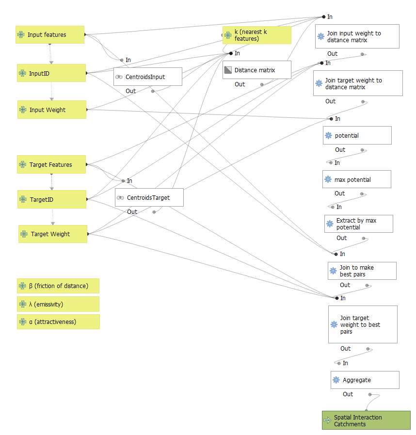
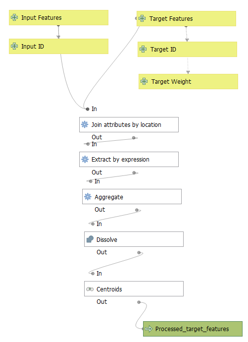
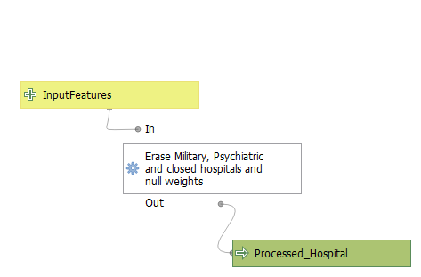
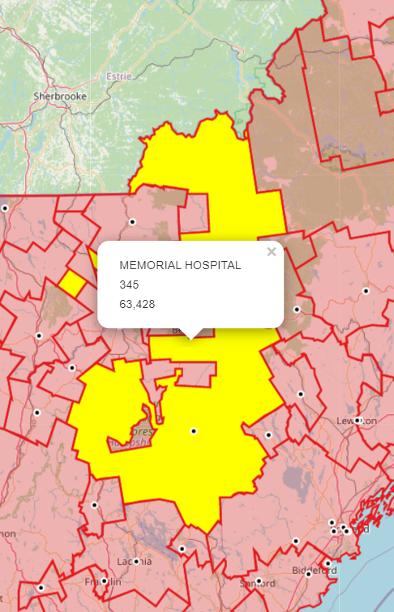

### Model 1: Gravity Model of Spatial Interaction:
This model calculates spatial interaction catchments using the gravity model of spatial interaction.
Catchments are calculated by measuring the maximum potential for interaction between an input feature
and a target feature. The model takes into account three factors that can be customized: attractiveness of target
features (α), friction of distance (β) and emissivity of input features (λ). All input features that have highest
 potential interaction with the same target feature are dissolved into a spatial interaction catchment feature of
  the same layer format as the input features/layer.

Download model [here](models/GravityModel.model3)

### Model 2: Preprocessing of target feature layer for Gravity Model.

This model takes in the target and input features to be used in the Gravity Model of Spatial Interaction to be preprocessed.
All target features found within the same input feature are aggregated and summarized into a centroid (calculated from dissolved target features).
The output is a target layer is a filtered version of the target features that conserves all attribute fields.

Download model [here](models/TargetFt.model3)

### Model 3 Preprocessing Model of Homeland Security Hospital data:
The only purpose of this model is to prepare Homeland Security Hospital Data to exclude military, psychiatric, closed hospitals and null weights
features with the following expression: "TYPE" != 'MILITARY' AND "TYPE" != 'PSYCHIATRIC' AND "BEDS" > 0 AND "STATUS" = 'OPEN'.
 This model is specifically design for the Homeland Security Hospital data

Download model [here](models/Homeland.model3)

#### Clarifications
- To run the gravity model of Spatial interaction with the Homeland Security Hospital data, the user should run the data through both Model 3 and Model 2 before using the layer in Model 1.
- For any other kind of target feature preprocessing the user should only use Model 2.

### Comparison with Dartmouth Hospital Service Areas
Click [here](assets/) to access map

In this interactive map you can see both hospital interaction catchments derived by the model presented in this page
and the Dartmouth Atlas for the New England Region of the United States. Catchments produced by the Dartmouth Atlas seem to be more compact than the ones generated by
my gravity model. Generally, there is agreement on the catchment areas, but there is a lot of room for improvement that can be achieved by modifying the α, β and λ parameters.
As seen in the example image below, the catchment for the Memorial Hospital seems to be very extensive and even has some catchment islands, this was a very common problem seen in the catchments produced by this model. A possible solution may be to increase the influence of friction of distance by modifying the β parameter. Moreover, adjusting the emmisitivity of hospitals based on their weight may help to create catchment areas more similar to Dartmouth's.

### Data sources and References
- [Homeland Security Data](https://services1.arcgis.com/Hp6G80Pky0om7QvQ/ArcGIS/rest/services/Hospitals_1/FeatureServer)
- [Dartmouth Hospital Service Areas](https://atlasdata.dartmouth.edu/downloads/supplemental#boundaries)
- New Englands Towns with Population data from American Community Survey 2018 5-year Average put together by Prof. Joseph Holler. Geopackage can be found [here](https://gis4dev.github.io/lessons/assets/netown.gpkg)

Dartmouth Atlas User Agreement:
  - _The data set forth at [this map](assets/) of publication/press release was obtained from Dartmouth Atlas Data website, which was funded by the Robert Wood Johnson Foundation, The Dartmouth Clinical and Translational Science Institute, under award number UL1TR001086 from the National Center for Advancing Translational Sciences (NCATS) of the National Institutes of Health (NIH), and in part, by the National Institute of Aging, under award number U01 AG046830."_
