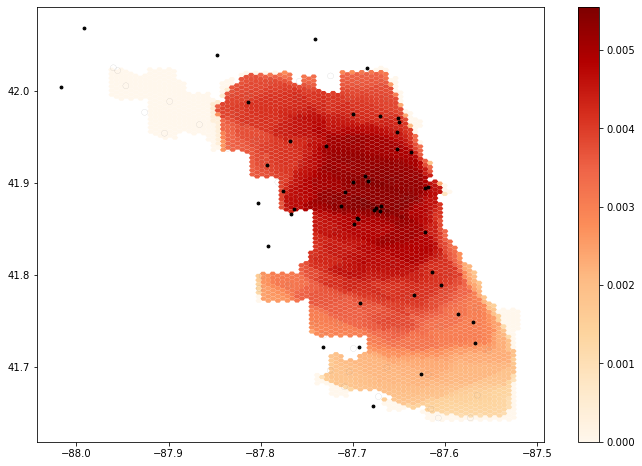
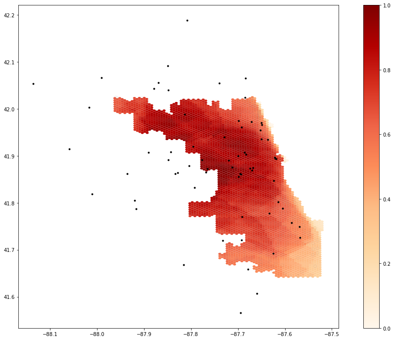
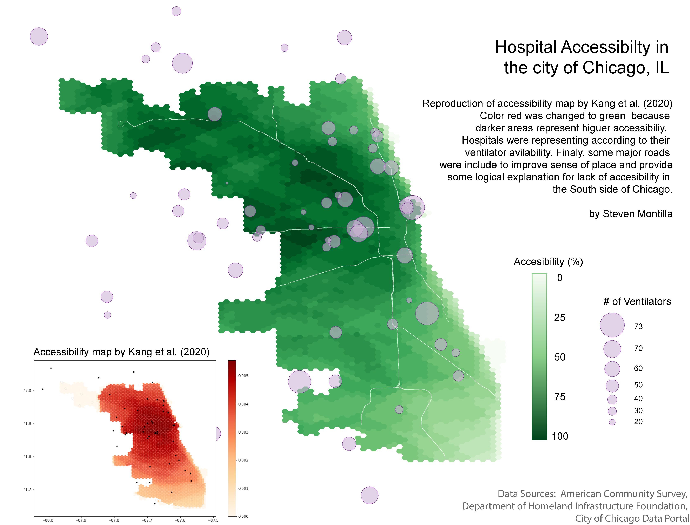

**Reproduction of**
# Reproduction of COVID-19 Healthcare Accessibility in Chicago

Replication Materials Available at: [RP-Malcomb forked repository](https://github.com/stevenmontilla/RP-Kang)

Created: `26 May 2021`
Revised: `26 May 2021`

## Introduction
Kang et al. (2020) developed a replicable methodology to assess accessibility to hospital beds and ventilators in the city of Chicago. Their motivation was the rapid growth of the COVID-19 pandemic. They emphasize the need for rapidly diagnosing access to healthcare, and developed a methodology that generates this information rather quickly. Moreover, they publicly published their methodology through a Pyhton Notebook that outlines and provides almost everything needed for analysis.

## Materials and Methods

The reproduction data was accessed through the cybergisx repository provided by the original study authors, and fixed for bugs by Prof. Holler.

**Data and sources**
- Road network: accessed through an Open Street Map python library called OSMNX
- Population: American Community Survey
- Hospital information: Homeland Infrastructure Foundation-Level Data.
  - Specifically, ICU beds and ventilator counts.
- Covid-19 confirmed cases: this dataset was provided through the Illinois Department of Public Health

The study was focused on accessibility in Chicago, IL, but the methodology is meant to be applicable in different geographies and even in different contexts outside of healthcare.

In general terms, they calculated accessibility by increasing the accessibility score of a population if it was within the 30 minute hospital service catchments areas based on driving times along the road network. This approach is called a two-step floating catchment area, but it does not account for friction of distance. Therefore, a population that is 30 minutes away from the hospital will be considered to have the same access as one that is 5 minutes away. To account for friction of distance, they implemented the enhanced two-step catchment area (E2SFCA) method, and defined service catchments based on 10, 20, and 30 minute drives.

One factor that this methodology does not take into account is the gravity of the hospitals based on their size (number of beds or ventilators). Therefore, all hospital are considered to provide the same access regardless of size.

## Modifications to Kang et al. (2020)

Our class identified possible sources of error in the analysis related to edge effects. The model takes into account hospitals outside of Chicago for analysis. However, the road network used did not reach these hospitals. In order to calculate driving times from the hospitals, hospital points needed to be reassigned to the closest valid node in the road network. Thus, hospitals outside of Chicago were assigned to nodes at the edges of the city, likely inflating the estimates of accessibility at those areas. To address this problem, our class determined that the best way to go about it would be to increase the size of the road network.

Increasing the road network generated some unexpected errors that Maja Cannavo was able to solve by modifying the original script from:

```python
def network_setting(network):
    _nodes_removed = len([n for (n, deg) in network.out_degree() if deg ==0])
    network.remove_nodes_from([n for (n, deg) in network.out_degree() if deg ==0])
    for component in list(nx.strongly_connected_components(network)):
        if len(component)<10:
            for node in component:
                _nodes_removed+=1
                network.remove_node(node)
    for u, v, k, data in tqdm(G.edges(data=True, keys=True),position=0):
        if 'maxspeed' in data.keys():
            speed_type = type(data['maxspeed'])
            if (speed_type==str):
                if len(data['maxspeed'].split(','))==2:
                    data['maxspeed']=float(data['maxspeed'].split(',')[0])               
                elif data['maxspeed']=='signals':
                    data['maxspeed']=35.0 # drive speed setting as 35 miles
                else:
                    data['maxspeed']=float(data['maxspeed'].split()[0])
            else:
                data['maxspeed']=float(data['maxspeed'][0].split()[0])
        else:
            data['maxspeed']= 35.0 #miles
        data['maxspeed_meters'] = data['maxspeed']*26.8223 # convert mile to meter
        data['time'] = float(data['length'])/ data['maxspeed_meters']
    print("Removed {} nodes ({:2.4f}%) from the OSMNX network".format(_nodes_removed, _nodes_removed/float(network.number_of_nodes())))
    print("Number of nodes: {}".format(network.number_of_nodes()))
    print("Number of edges: {}".format(network.number_of_edges()))    
    return(network)
```
to
<br>
**note the addition of the TRY and EXCEPT clauses**
```python
def network_setting(network):
    _nodes_removed = len([n for (n, deg) in network.out_degree() if deg ==0])
    network.remove_nodes_from([n for (n, deg) in network.out_degree() if deg ==0])
    for component in list(nx.strongly_connected_components(network)):
        if len(component)<10:
            for node in component:
                _nodes_removed+=1
                network.remove_node(node)
    for u, v, k, data in tqdm(G.edges(data=True, keys=True),position=0):
        if 'maxspeed' in data.keys():
            speed_type = type(data['maxspeed'])
            if (speed_type==str):
                try:
                    if len(data['maxspeed'].split(','))==2:
                        data['maxspeed']=float(data['maxspeed'].split(',')[0])                  
                    elif data['maxspeed']=='signals':
                        data['maxspeed']= 35.0 # drive speed setting as 35 miles
                    else:
                        data['maxspeed']= float(data['maxspeed'].split()[0])
                except:
                        data['maxspeed']= 35.0 #miles                                             
            else:
                try:
                    data['maxspeed']=float(data['maxspeed'][0].split()[0])
                except:
                    data['maxspeed']= 35.0                                                   
        else:
            data['maxspeed']= 35.0 #miles
        data['maxspeed_meters'] = data['maxspeed']*26.8223 # convert mile to meter
        data['time'] = float(data['length'])/ data['maxspeed_meters']
    print("Removed {} nodes ({:2.4f}%) from the OSMNX network".format(_nodes_removed, _nodes_removed/float(network.number_of_nodes())))
    print("Number of nodes: {}".format(network.number_of_nodes()))
    print("Number of edges: {}".format(network.number_of_edges()))    
    return(network)
```
This modification basically assigned a speed limit of 35 mph to all roads with faulty or unspecified driving speeds.

## Results and Discussion


Figure 1. Hospital accessibility in Chicago by Kang et al. 2020.
<br>

Hospital accessibility in Chicago seems to be higher in the center of the city and gradually decrease as you go away from the center, especially towards the south. The results map produced by their script would be more easily understood if there was a label for the gradient.
<br>

Figure 2. Reproduction of Kang et al's hospital accessibility in Chicago with extended road network.
<br>

By increasing the road network, there was a shift north and west of the areas with higher accessibility. Morever, the northwest peninsula-like portion of the city had drastically higher rates of accessibility than in Figure 1.


Figure 3. Visualization suggestions for Kang et al. (2020) hospital accessibility maps.

Finally, Maddie Tango and I thought the maps generated by the script could be somewhat hard to interpret by someone who is not familiar with the work behind the scenes. Therefore, we decided to suggest modifications to the visualization that we think would improve how the map communicates accessibility.

As seen in Figure 3. the first change was to modify the color palette from a red gradient to a green one. In this case, darker areas are associated with hospital access. However, for a person that sees this map, it may communicate the opposite given the generalized perception of the color red. Secondly, in Figures 1 and 2, hospitals are represented equally despite their sizes. Therefore, we added proportional circles based on the number of ventilators (but could also be number of beds, etc...) to add some nuance to the representation of hospitals. Finally, I decided to include a major-road network (Class 1 roads from the City of Chicago Data Portal) to improve the sense of place of the map and to show the bias of access towards the center-north areas by the way the roads are built. In other words, areas with high access have high speed roads going both west-east and north-south, but areas lacking access in the south only have high speed roads going towards the CBD. Improving the high-speed road system going east-west in underserved areas could potentially improve their hospital accessibility.

## Conclusion

The reproduction of this study was successful. Comparing this reproduction experience with previous reproductions that we undertook, there was close to none hesitancy on whether or not the methodology was correct, given that we did not have to rely on only the published article to apply it. Having the complete methodology and materials used in the original study allowed us to shift our focus and energy on whether or not our interpretation of the methods section of the Kang et al. (2021) paper was correct, to digging deeper into the code and finding ways to improve it. It was a very gratifying experience to see the class come up with the suggestions for improvements.

## Acknowledgements
Thanks to Maddie Tango and Alitzel Villanueva for analyzing the code with me during lab. Thanks to Maddie Tango for brainstorming ideas for improvement with me and finding ways to implement them. Thanks to Maja Cannavo for sharing the solution to the Road Network errors and to Sam Marshall for explaining how the algorithm for cleaning up the road network worked. Thanks to the whole class for brainstorming ideas on how to improve the methodology. Finally, thanks to Kufre Udoh for helping me troubleshoot during lab and to Prof. Joe Holler and Kang et al. for providing the materials.

## References
Kang, J. Y., A. Michels, F. Lyu, Shaohua Wang, N. Agbodo, V. L. Freeman, and Shaowen Wang. 2020. Rapidly measuring spatial accessibility of COVID-19 healthcare resources: a case study of Illinois, USA. International Journal of Health Geographics 19 (1):1–17. DOI:10.1186/s12942-020-00229-x.
