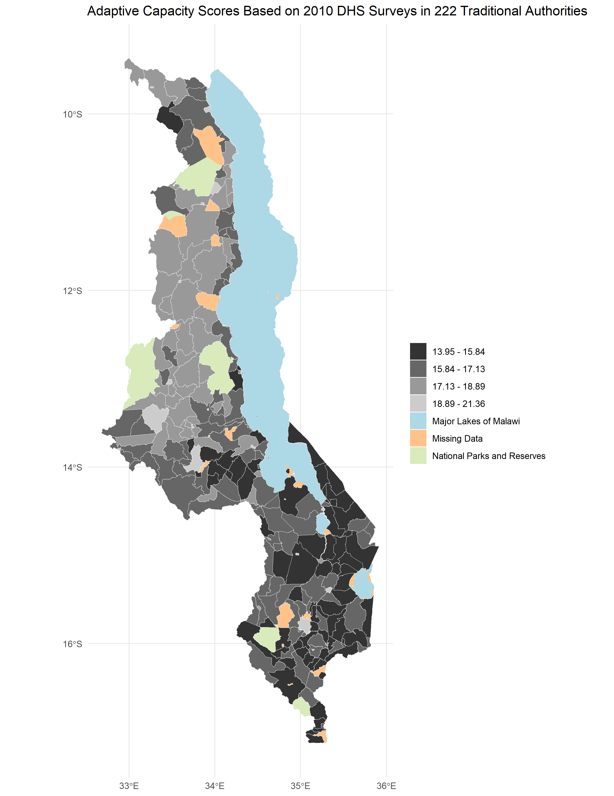

**Replication of**
# Vulnerability modeling for sub-Saharan Africa

Original study *by* Malcomb, D. W., E. A. Weaver, and A. R. Krakowka. 2014. Vulnerability modeling for sub-Saharan Africa: An operationalized approach in Malawi. *Applied Geography* 48:17–30. DOI:[10.1016/j.apgeog.2014.01.004](https://doi.org/10.1016/j.apgeog.2014.01.004)

Replication Authors:
W. Steven Montilla M., Joseph Holler, Kufre Udoh, Open Source GIScience students of fall 2019 and Spring 2021

Replication Materials Available at: [RP-Malcomb forked repository](https://github.com/stevenmontilla/RP-Malcomb)

Created: `25 April 2021`
Revised: `27 April 2021`

## Abstract

The original study is a multi-criteria analysis of vulnerability to Climate Change in Malawi, and is one of the earliest sub-national geographic models of climate change vulnerability for an African country. The study aims to be replicable, and had 40 citations in Google Scholar as of April 8, 2021.

## Original Study Information

The study region is the country of Malawi. The spatial support of input data includes DHS survey points, Traditional Authority boundaries, and raster grids of flood risk (0.833 degree resolution) and drought exposure (0.416 degree resolution).

The original study was published without data or code, but has detailed narrative description of the methodology. The methods used are feasible for undergraduate students to implement following completion of one introductory GIS course. The study states that its data is available for replication in 23 African countries.

### Data Description and Variables

Outline the data used in the study, including:

- sources of each data layer and
- the variable(s) used from each data source
- transformations applied to the variables (e.g. rescaling variables, calculating derived variables, aggregating to different geographic units, etc.)

This part may be compiled collaboratively as a group!
#### Overview
Malcomb et al. (2014) calculated household resilience seen in scores using three different data sources (refer to Fig. 2 of Malcomb et al. 2014)
- The variables to calculate Adaptive Capacity were obtained from the USAID's Demographic and Health Surveys (DHS).
- Livelihood sensitivity variables were taken from the USAID's Famine Early Warning Systems Network (FEWSNET).
- Finally, physical exposure variables were taken from the United Nations Environment Programme (UNEP).

#### Background of Data Sources

##### USAID's Demographic and Health Surveys
  [Demographic and Health Surveys (DHS)](https://dhsprogram.com/Methodology/Survey-Types/DHS.cfm) are nationally-representative household surveys that provide data for a wide range of monitoring and impact evaluation indicators in the areas of population, health, and nutrition (from DHS website). These surveys record assets and access to resources at the household level. The following list outlines the specific variables that were taken into account in this part of the replication. Specifically, DHS data was only used to obtain assets and access data to calculate Adaptive Capacity (40% of the Household Resilience Score). DHS data requires use authorization by the DHS and therefore cannot be shared in this report or through the data repository. You can get authorization to obtain the data on this [here](https://dhsprogram.com/)

  For **ASSETS**

  |  **Name listed by Malcomb et al. (2014)**  |      **Variable (from DHS 2010) used in replication**    | **Possible values**                          |
  |:--------------------------------------:|:----------------------------------------------------:|------------------------------------------|
  |         # Livestock Units (4%)         |           Livestock, herds or farm animals           | yes or no                                |
  |                                        | NA - cows, bulls own                                 | 0 - 95+, unknown                         |
  |                                        |            NA - horses, donkeys, mules own           | 0 - 95+, unknown                         |
  |                                        |                       Goats own                      | 0 - 95+, unknown                         |
  |                                        | Sheep own                                            | 0 - 95+, unknown                         |
  |                                        | Poultry own                                          | 0 - 95+, unknown                         |
  |                                        | Other own                                            | 0 - 95+, unknown                         |
  | Arable Land (Hectares) (6%)            | "Hectares for agricultural land"                     | 95 or more 98 "unknown"                  |
  | # in Household Sick in Past 12 mo (3%) | "Member has been very sick for 3+ months last year"  | YES/ NO/ DK                              |
  |                                        | "Mother has been very sick for 3+ months last year"  | YES/ NO/ DK                              |
  |                                        | "Father has been very sick for 3+ months last year"  | YES/ NO/ DK                              |
  |                                        | "Mother/father dead or been very sick for 3+ months" | YES/ NO/ DK                              |
  | Wealth Index Score (4%)                | DHS 2010, HV270                                      | poorest, poorer, middle, richer, richest |
  | # of Orphans in Household (3%)         | Number of orphans and vulnerable children            | n                                        |

  For **ACCESS**

  | **Name listed by Malcomb et al. (2014)** | **Variable (from DHS 2010) used in replication** | **Possible values**                                                                                                                                                           |
  |:------------------------------------:|:--------------------------------------------:|---------------------------------------------------------------------------------------------------------------------------------------------------------------------------|
  |       Time to water source (4%)      |          Time to get to water source         | On premises, do not know                                                                                                                                                  |
  |           Electricity (3%)           | Has electricity                              | Yes/NO                                                                                                                                                                    |
  |       Type of cooking fuel (2%)      |             Type of cooking fuel             | Electricity, LPG/Natural gas,  Natural gas, Biogas, Kerosene,  Coal/lignite, charcoal, wood,  straw/shrubs/grass, agricultural c rop, animal dung, no food cooked,  other |
  |     Sex of head of household (2%)    |          "Sex of head of household"          | Male, Female                                                                                                                                                              |
  |         Own a cell phone (4%)        | has a mobile telephone                       | Yes/NO                                                                                                                                                                    |
  |           Own a radio (3%)           | Has Radio                                    | Yes/NO                                                                                                                                                                    |
  |   House setting (urban/rural) (2%)   | type of place of residence                   | Urban, Rural                                                                                                                                                              |

##### USAID's Famine Early Warning Network (FEWSNET)
[FEWSNET](https://fews.net/about-us), the Famine Early Warning Systems Network, is a leading provider of early warning and analysis on acute food insecurity around the world (from FEWSNET website). One of the goals of the FEWSNET is to predict future cases of acute food insecurity in order to inform humanitarian response. Therefore, the data they collect is tailored towards measuring the vulnerability of communities mainly focused on land use practices, food sourcing, and coping strategies of the communities surveyed. Malcomb et al. (2014) used variables from the FEWSNET 2005 survey in Malawi to calculate the 20% Livelihood Sensitivity portion of the Household Resilience scores. However, they were not clear on which variables exactly they used, so we had to use our judgement to make the our best informed guesses. The following table shows the attributes and calculations that we carried out in contrast to what was listed in the paper.

|             **Name listed by Malcomb et al. (2014)**                                             |                                     **Variable (from FEWSNET 2005) used in
 replication**                                    |   **Possible values** |
|:----------------------------------------------------------------------------------------------------------------------------:|:-------------------------------------------------------------------------------------------------------------------:|:---------------:|
|                                                    Food From Own Farm (6%)                                                   |                                                Sources of food: crops                                               | x%              |
|                                                  Income From Wage Labor (6%)                                                 | Sources of Cash: labour / total income                                                                              | x%              |
|           Income From Cash Crops (4%)  (% labor that is susceptible to market shocks (tobacco, sugar, tea, coffee))          | Sources of cash: crops / total income  (Included income from **all** crops due to vague definition of _cash crops_) | x%              |
| Disaster Coping Strategy (4%)  (potential sources of additional food and income **that lead  to environmental degradation**) |                           Income from sales of firewood, grass, wild foods / total income                           | x%              |

##### United Nations Environment Programme (UNEP)/ Global Resource Information Database (GRID) Data:

The GRID-Geneva database comes from a partnership between the UNEP, the Swiss Federal Office for the Environment and the University of Geneva. Their focus is on processing, analysis and creating models from satellite data using remote sensing techniques and GIS with the goal of providing scientific information to decision makers.(Learn more [here](https://unepgrid.ch/en/about-us/grid]))
The Global Risk Data Platforms is the product of a multiagency effort to share spatial information on global risk from natural hazards. (Learn more [here](https://preview.grid.unep.ch/))

- Following the procedure from Malcomb et al. (2014), we obtained the Estimated Risk for Flood Hazard and Exposition to Drought Events layers from this data source.

#### Data transformations

The first transformation of the data was normalization. Since all variables used came in different units, it would be impossible to compare them without normalizing them. Malcomb et al. (2014) do so by transforming all variables to a scale of 0-5 (6 data categories). However, the script becomes confusing when they mention that they used quintiles (5 data categories). Since their highest score was 5, but they only had 5 categories, we used the quintile breaks and modified it to be a scale from 1-5 resulting in 5 total categories.

Capacity scores were weighted following table 2. of Malcomb et al. and then summed to calculate capacity scores with the corresponding weighted variables. We multiplied the score by 20 to match the scale on Malcomb et al's figures.

### Analytical Specification

The original study was conducted using ArcGIS and STATA, but does not state which versions of these software were used.
The replication study will use R.

## Materials and Procedure

### Step 1: Preprocessing of Geographic Boundaries

#### Workflow First Version

DHS Households table (1 row/house) → ***field calc*** → conversion to 0-5 scale → weighted A/C score → ***join by attribute*** w/ DHS data points (village level) → ***spatial join AND group*** w/ traditional authorities (GADM adm_2) → traditional authorities w/ Capacity Score → ***Raster***

Drought exposure → ***rescale 0-5***

Flood risk → ***rescale 0-5***

Livelihood zones → ***copy #s from spreadsheet*** →***rescale 0-5*** →  ***Rasterize*** → ***Raster Calc*** (w/ Drought Exposure and Flood Risk Rasters)

### Step 2
Data Input: UNEP/grid Europe, Famine early warning network → ***Raster*** → ***Weight values***: All vulnerability measures were weighted (table 2) and normalized between 0 & 5 (RStudio)

### Step 3: Creating the Model of Vulnerability
***Calculate***: Household resilience = adaptive capacity + livelihood sensitivity - biophysical exposure

#### Revised Version
1. Download traditional authorities: MWI_adm2.shp
1. Adding TA and LZ ids to DHS clusters
1. Removing HH entries with invalid or unknown values
1. Aggregating HH data to DHA clusters, and then joining to traditional authorities to get:
  ta_capacity_2010
1. Removing index and livestock values that were NA
1. Sum of Livestock by HH
1. Scale adaptive capacity fields (from DHS data) on scale of 1 - 5 to match Malcomb et al.
1. Weight capacity based on table 2 in Malcomb et al.
1. Calculate capacity by summing all weighted capacity fields
1. Joining mean capacities to TA polygon layer
  1. Summarize capacity from households to traditional authorities
1. Making capacity score resemble Malcomb et al’s work (scores on range of 0-20) by multiplying capacity score by 20
1. Categorizing capacities using natural jenks methods
1. Creating blank raster and setting extent of Malawi - CRS: 4326
1. Reproject, clip and resampling flood risk and drought exposure rasters to new extent and cell size
  1. Uses bilinear resampling for drought to average continuous population exposure values
  1. Uses nearest neighbor resampling for flood risk to preserve integer values
  1. Removing factors and recasting them as integers
  1. Clipping TAs with LZs to remove lake
1. Rasterizing final TA capacity layer
1. Masking flood and drought layers
1. Reclassify drought raster into quantiles
1. Add all RASTERs together to calculate final output: final = (40 - geo) * 0.40 + drought * 0.20 + flood * 0.20
1. Use zonal statistics to aggregate raster to TA geometry for final calculation of vulnerability in each traditional authority

#### Final Revision

Besides what is above, we added the variables for the Livelihood zones procedures and the comparison methodology.

## Replication Results

For each output from the original study (mainly figure 4 and figure 5), present separately the results of the replication attempt.

2.	State whether the original study was or was not supported by the replication
3.	State whether any hypothesis linked to a planned deviation from the original study was supported. Provide key statistics and related reasoning.

Figures to Include:
- map of resilience by traditional authority in 2010, analagous to figure 4 of the original study

- map of vulnerability in Malawi, analagous to figure 5 of the original study

- map of difference between your figure 4 and the original figure 4

- map of difference between your figure 5 and the original figure 5

## Unplanned Deviations from the Protocol

Summarize changes and uncertainties between
- your interpretation and plan for the workflow based on reading the paper
- your final workflow after accessing the data and code and completing the code

## Discussion

Provide a summary and interpretation of the key findings of the replication *vis-a-vis* the original study results. If the attempt was a failure, discuss possible causes of the failure. In this replication, any failure is probably due to practical causes, which may include:
- lack of data
- lack of code
- lack of details in the original analysis
- uncertainties due to manner in which data has been used

Epistemic uncertainty from use of expert opinion: Malcomb attribute designations

## Conclusion

Restate the key findings and discuss their broader societal implications or contributions to theory.
Do the research findings suggest a need for any future research?

## References

Include any referenced studies or materials in the [AAG Style of author-date referencing](https://www.tandf.co.uk//journals/authors/style/reference/tf_USChicagoB.pdf).

####  Report Template References & License

This template was developed by Peter Kedron and Joseph Holler with funding support from HEGS-2049837. This template is an adaptation of the ReScience Article Template Developed by N.P Rougier, released under a GPL version 3 license and available here: https://github.com/ReScience/template. Copyright © Nicolas Rougier and coauthors. It also draws inspiration from the pre-registration protocol of the Open Science Framework and the replication studies of Camerer et al. (2016, 2018). See https://osf.io/pfdyw/ and https://osf.io/bzm54/

Camerer, C. F., A. Dreber, E. Forsell, T.-H. Ho, J. Huber, M. Johannesson, M. Kirchler, J. Almenberg, A. Altmejd, T. Chan, E. Heikensten, F. Holzmeister, T. Imai, S. Isaksson, G. Nave, T. Pfeiffer, M. Razen, and H. Wu. 2016. Evaluating replicability of laboratory experiments in economics. Science 351 (6280):1433–1436. https://www.sciencemag.org/lookup/doi/10.1126/science.aaf0918.

Camerer, C. F., A. Dreber, F. Holzmeister, T.-H. Ho, J. Huber, M. Johannesson, M. Kirchler, G. Nave, B. A. Nosek, T. Pfeiffer, A. Altmejd, N. Buttrick, T. Chan, Y. Chen, E. Forsell, A. Gampa, E. Heikensten, L. Hummer, T. Imai, S. Isaksson, D. Manfredi, J. Rose, E.-J. Wagenmakers, and H. Wu. 2018. Evaluating the replicability of social science experiments in Nature and Science between 2010 and 2015. Nature Human Behaviour 2 (9):637–644. http://www.nature.com/articles/s41562-018-0399-z.
