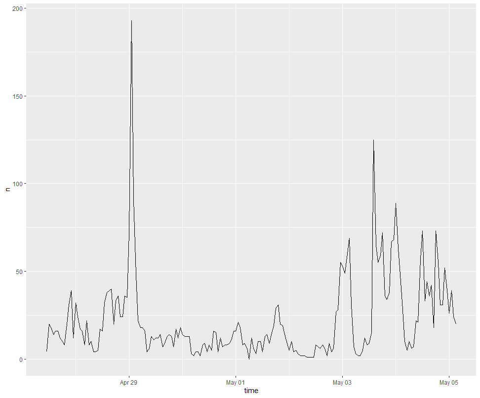
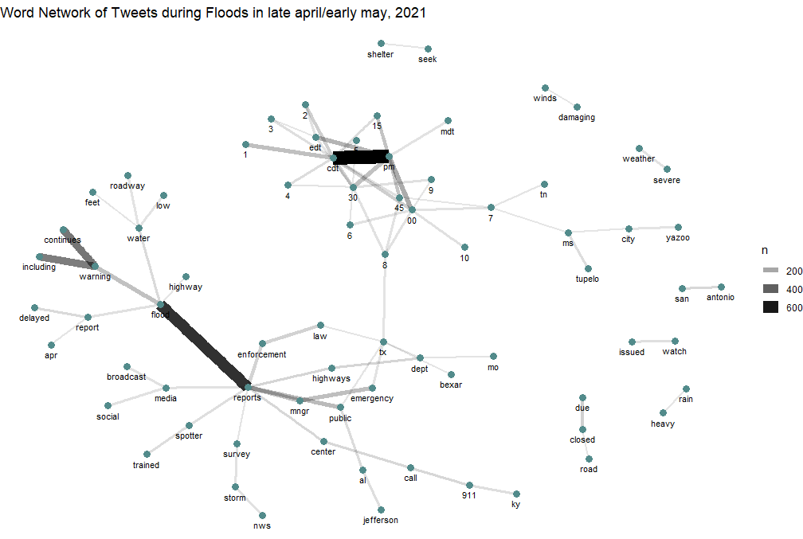
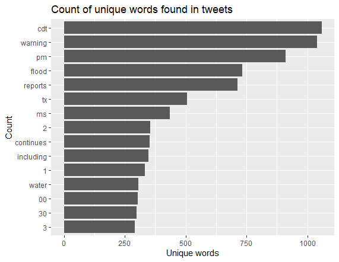
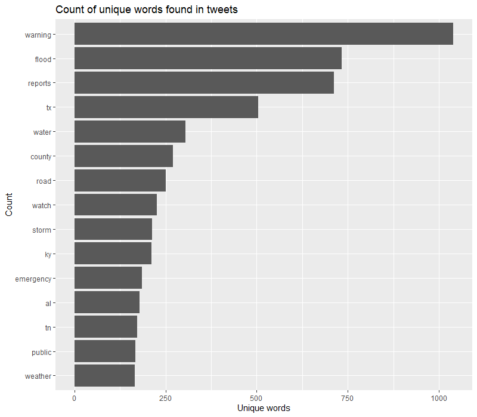
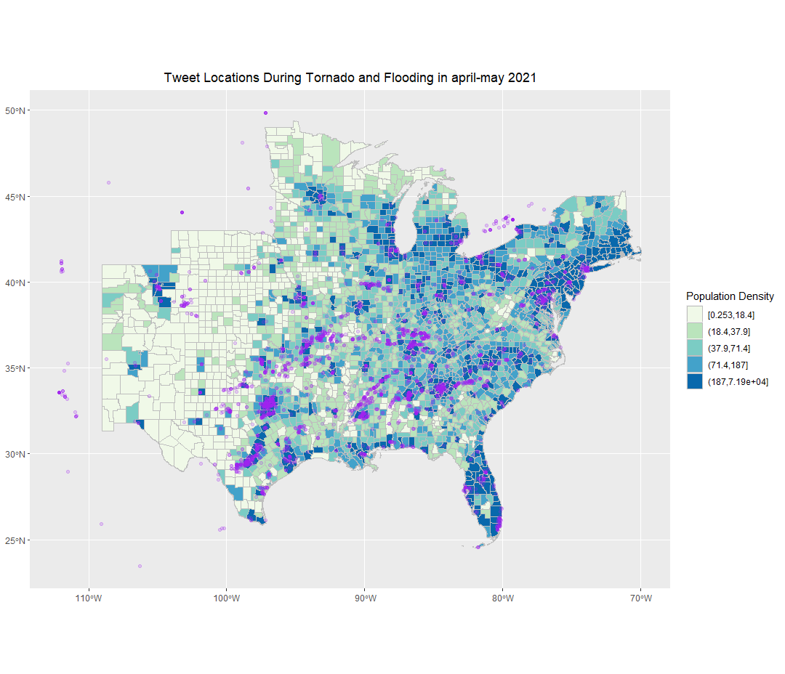
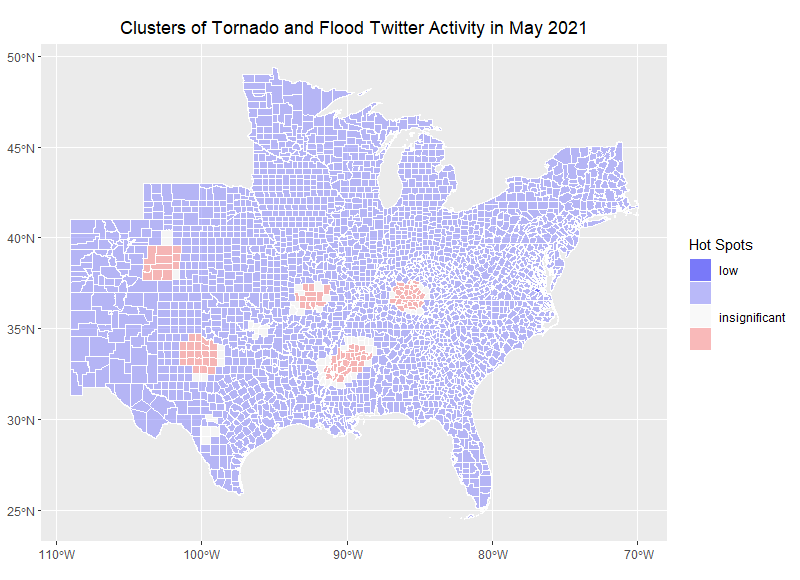

**Replication of**
# Spatial, temporal and content analysis of Twitter data

Original study *by* Wang, Z., X. Ye, and M. H. Tsou. 2016. Spatial, temporal, and content analysis of Twitter for wildfire hazards. *Natural Hazards* 83 (1):523–540. DOI:[10.1007/s11069-016-2329-6](https://doi.org/10.1007/s11069-016-2329-6).
and
First replication study by Holler, J. 2021 (in preparation). Hurricane Dorian vs Sharpie Pen: an empirical test of social amplification of risk on social media.

Replication Author:
W. Steven Montilla Morantes

Replication Materials Available at: [Forked RE-Dorian repository](https://github.com/stevenmontilla/RE-Dorian)

Created: `21 May 2021`
Revised: `21 May 2021`

## Abstract

Nowadays, the use of social media platforms is extremely normalized. People continuously post information about their lives, their experiences, creations, etc... They react to what happens around them and resort to the internet to share it with everyone else. In many cases, social media has become a  way to receive help or spread awareness about an issue or event. For example, in march of 2020, Middlebury students started a mutual aid campaign on social media dedicated to helping peers secure housing or other securities that they lost due to the pandemic.

Beyond what the users themselves can do to good with social media, there is much to be learned from the way users behave in space and time when stresses occur. In this way of looking at social media, we as researchers are not as interested in the individual context of a post, but on the dynamics and discourse of larger populations in the platform. Twitter is a specially useful social media platform to study the behaviors of the population in the face of stresses, at least in the countries where it is widely used enough. From personal observation, the platform is set up to be candid, concise and highly engaging. Unlike other platforms such as Instagram, twitter users post more frequently and about a wider range of topics. However, as Crawford & Finn (2015) discuss, analysis done with twitter data may provide valuable insights, but there needs to be recognition of the biases and uncertainty introduced by the way the twitter algorithm works and how it lets its users interact with information.

Utilizing the unique data that twitter users generate, Wang et al (2016) studied Twitter activity related to wildfires in California, finding that the social media data can help characterize fires across space and time. Wang et al's methodology could also be used in a variety of contexts to characterize other hazards.

Holler (2021) is studying Twitter data for Hurricane Dorian on the Atlantic coast, finding that in spite of tending news and social media content regarding a false narrative of risk, original Tweets still clustered significantly along the real hurricane track, and only along the hurricane track.

Reproducing and replicating spatial research of hazards done by Holler (2021) and Wang et al (2016) continues to be relevant because this approach to hazard characterization is fairly new. Thus, reproduction and replication of these sort of studies would help in the development of more robust methodologies to analyze big data from social media.

In his replication study, I will be replicating Wang et al (2016) and Holler (2021) in the context of tornadoes and flood events in the southern plains of the United States in late April to early May.


## Original Study Information

Wang et al (2016) developed a methodology to analyze twitter activity during wildfires around the San Diego area in May of 2014. They used the twitter search API to collect tweets that contained the words “wildfire” and “fire” and then a sub-set of tweet containing information about specific locations where fires occurred during that time frame. From the totality of tweets collected, they were only interested in those with geospatial information. They used the ‘coordinates’ field to filter out useless tweets. Having georeferenced tweets, they performed kernel density estimation to understand the spatial pattern of the tweets. This may represent a problem because areas with larger population may produce more twitter activity in general. Thus, the results may appear as a population map which would not provide useful information for the analysis. Therefore, they had to normalize it by making a dual kernel density estimation where the number of tweets in each unit of analysis was divided by its corresponding population value. They also conducted other analysis such as interaction networks or word analysis to understand how people where communicating about the fires.

Holler (2021) loosely replicated the methods of Wang et al (2016) for the case of Hurricane Dorian's landfall on the U.S. mainland during the 2019 Atlantic Hurricane season. Data was based on Twitter Search API queries for the words "Dorian", "hurricane" or "sharpiegate". The replication materials for this analysis can be found in the same repository linked at the top of this page.

Holler modified Wang et al's methods by not searching for retweets for network analysis, focusing instead on original Tweet content with keywords hurricane, Dorian, or sharpiegate (a trending hashtag referring to the storm). Holler modified the methodology for normalizing tweet data by creating a normalized Tweet difference index and extended the methodology to test for spatial clustering with the local Getis-Ord statistic. The study tested a hypothesis that false narratives of hurricane risk promulgated at the highest levels of the United States government would significantly distort the geographic distribution of Twitter activity related to the hurricane and its impacts, finding that original Twitter data still clustered only in the affected areas of the Atlantic coast in spite of false narratives about risk of a westward track through Alabama.

Wang et al (2016) conducted their study using the `tm` and `igraph` packages in `R 3.1.2`. Is it known what GIS software was used for spatial analysis?
The replication study by Holler (2021) used R, including the rtweet, rehydratoR, igraph, sf, and spdep packages for analysis.

## Materials and Procedure

For this replication, I focused on activity related to tornadoes and floods in the southern plains of the United States.

I used the methodology/ code provided by Holler (2021) to perform this analysis.

Data was collected with the following search query:
<br>
```
akflood = search_tweets("flooding OR drainage OR underwater
                        OR flash OR tornado OR tornadoes",
                       n=200000, include_rts=FALSE,
                       token=twitter_token,
                       geocode="36,-94,1000mi",
                       retryonratelimit=TRUE)
```
<br>                       
- Click [Here](https://github.com/stevenmontilla/RE-Dorian/tree/main/data/raw/public) to download the tweet_ids for the tweets pulled with that query in early May, 2020.  
<br>


|          **Tweet type**          |  **file name**  | **# tweets** |
|:----------------------------:|:-----------:|:--------:|
|    Baseline Tweet Activity   |  mayids.txt | 215,985  |
| Flood/Tornado related tweets | akflood.txt | 78,144   |

<br>

- These tweets were filtered for location information resulting in much smaller datasets, the filtered tweet ids can be found in the derived folder of the repository [here](https://github.com/stevenmontilla/RE-Dorian/tree/main/data/derived/public):

<br>

|          **Tweet type**          |  **file name**  | **# tweets** |
|:----------------------------:|:-----------:|:--------:|
|    Baseline Tweet Activity   |  mayids.txt | 8497  |
| Flood/Tornado related tweets | akfloodids.txt | 4089   |

<br>


 - **around 3.9 percent of tweets pulled were geocoded**

<br>

Data was normilized using population information from the US census accessed through the **tidycensus** R package.
<br>
**note**: in order to reproduce or replicate this analysis you need to:
  - [Apply for a Twitter developer account here](https://developer.twitter.com/en/apply-for-access)
  - [Apply for a cesus API key here](https://api.census.gov/data/key_signup.html)
<br>
These credentials are necessary to access and utilize Twitter and Census data through their integration with R.


## Replication Results


Figure 1. Temporal Analysis
<br>

Figure 2. Word network of tweet content
<br>

Figure 3. Top words used in tweets not taking into account stop words.
<br>

Figure 4. Top words used in tweets not taking into account extended stop words list.
<br>

Figure 5. Spatial distribution of twitter activity
<br>

<br>
Figure 6. Spatial distribution of significant clusters of tornado/flood twitter activity.
<br>
## Unplanned Deviations from the Protocol

When conducting the Contextual/Text analysis, I appended more words to the stop word list to improve the contents of the word rank. As seen in figure 3, many of the most used words referred to numbers and time. Appending most of the numbers and time zone abbreviations to the stop word list resulted in a cleaner version of the word rank that unveiled other important words in the general discourse such as 'storm', 'emergency', and locations such as 'tx', 'ky','al' and 'tn'

Both the first and second versions of this graph can be seen above in Fig. 3 and Fig. 4.

<br>
## Discussion

Provide a summary and interpretation of your key findings in relation to your research question. Mention if findings confirm or contradict patterns observed by Wang et al (2016) or by Holler (2021)

The spatial distribution of significant clusters of activity related to tornadoes in early May correlated with the [locations of the tornado outbreak of May 2-4, 2021](https://en.wikipedia.org/wiki/Tornado_outbreak_of_May_2%E2%80%934,_2021). Therefore, the results of this replication are consistent with those of Wang et al (2016), Holler (2021) in that there were significant activity clusters in the areas affected by the tornado outbreak. It was surprising to see that even smaller and dissipated hazard events would still create significant activity clusters given that Holler (2021) studied a much larger phenomenon, with more media attention and a vast geographical trajectory.

In terms of the contextual tweet analysis, it appears to be that the majority of tweets focused on providing times and locations. As seen in figure 3 and 4, many of the top words such as 'cdt', '00','30','pm' described the temporal characteristics of the events. Words such as 'tx', 'tn', 'al','ky' referred to spatial characteristics of the outbreak. Finally, the use of words such 'emergency' and 'warning' and other phrases seen in Fig 2. such as 'seek'--'shelter'; 'call'--'911'; 'flood'--'warning'--'continues'.

Finally, it would be worth to mention that epistemic uncertainty may have been introduced in the selection of words for the initial query for this analysis. Possibly, the inclusion of somewhat vague words such as 'flash', 'underwater' could have added a number of irrelevant tweets to the analysis. Even though the rational for including these words was based on their appearance on several tweets related to the situation, these words could also be used in completely different contexts. Finally, querying for both flooding events and tornados may have also weakened the strength of the activity clusters, as these events were not necessarily happening in all areas affected by the tornadoes and vice-versa.

## Conclusion

The goal of this study was to replicate the approaches developed by Wang et al. (2016) and replicated by Holler (2021) in the context of the recent tornado outbreak in the southern plains of the United States. As Wang et al. (2016) and Holler (2021) concluded, the analysis of twitter activity was accurate in characterizing the spatial and temporal properties of the event. In this case, the significant activity clusters correlated with recorded tornado events in the region. However, the magnitude of these clusters may have been affected by epistemic uncertainty introduced in the analysis when creating the original query to gather the data. Therefore, it would be useful to reproduce this analysis with the slight modification of improving the original query to less context dependent words.

## Acknowledgements
  Thanks to Prof. Holler for providing the base R script in which this analysis is based. Thanks to Jackson Mumper with whom I worked closely in lab to understand the code and methodology and Maddie Tango for answering my questions and being always happy to help.

####  Report Template References & License

This template was developed by Peter Kedron and Joseph Holler with funding support from HEGS-2049837. This template is an adaptation of the ReScience Article Template Developed by N.P Rougier, released under a GPL version 3 license and available here: https://github.com/ReScience/template. Copyright © Nicolas Rougier and coauthors. It also draws inspiration from the pre-registration protocol of the Open Science Framework and the replication studies of Camerer et al. (2016, 2018). See https://osf.io/pfdyw/ and https://osf.io/bzm54/

Camerer, C. F., A. Dreber, E. Forsell, T.-H. Ho, J. Huber, M. Johannesson, M. Kirchler, J. Almenberg, A. Altmejd, T. Chan, E. Heikensten, F. Holzmeister, T. Imai, S. Isaksson, G. Nave, T. Pfeiffer, M. Razen, and H. Wu. 2016. Evaluating replicability of laboratory experiments in economics. Science 351 (6280):1433–1436. https://www.sciencemag.org/lookup/doi/10.1126/science.aaf0918.

Camerer, C. F., A. Dreber, F. Holzmeister, T.-H. Ho, J. Huber, M. Johannesson, M. Kirchler, G. Nave, B. A. Nosek, T. Pfeiffer, A. Altmejd, N. Buttrick, T. Chan, Y. Chen, E. Forsell, A. Gampa, E. Heikensten, L. Hummer, T. Imai, S. Isaksson, D. Manfredi, J. Rose, E.-J. Wagenmakers, and H. Wu. 2018. Evaluating the replicability of social science experiments in Nature and Science between 2010 and 2015. Nature Human Behaviour 2 (9):637–644. http://www.nature.com/articles/s41562-018-0399-z.
